```mermaid
sequenceDiagram
    participant User
    participant API as FastAPI Endpoint
    participant Pipeline as SearchPipeline
    participant SearchAgent as SearchAgent (Pydantic AI)
    participant BrowseAgent as BrowseAgent (Pydantic AI)
    participant SynthAgent as SynthesizerAgent (Pydantic AI)
    participant SearchSvc as SearchService (SearxNG/SerperDev)
    participant EmbedSvc as EmbeddingService
    participant DB as PostgreSQL (pgvector)
    participant Langfuse as Langfuse Tracing

    User->>API: POST /v1/search {query, mode: "search"}
    API->>DB: Create ResearchSession (status: pending)
    API->>Pipeline: execute(query, session_id)
    
    Note over Pipeline: Step 1: Query Decomposition
    Pipeline->>SearchAgent: decompose_query(query)
    SearchAgent->>Langfuse: Start trace: "query_decomposition"
    SearchAgent->>OpenRouter: LLM call (PLANNING_MODEL)
    OpenRouter-->>SearchAgent: {sub_queries: [...], focus: "..."}
    SearchAgent->>Langfuse: Log trace with tokens/cost
    SearchAgent-->>Pipeline: [sub_query_1, sub_query_2, sub_query_3]
    
    Note over Pipeline: Step 2: Parallel Search (max 4 queries)
    par Search Query 1
        Pipeline->>SearchSvc: search(sub_query_1)
        SearchSvc->>SearxNG: GET /?q=sub_query_1
        SearxNG-->>SearchSvc: {results: [...]}
        SearchSvc-->>Pipeline: [url1, url2, url3...]
    and Search Query 2
        Pipeline->>SearchSvc: search(sub_query_2)
        SearchSvc->>SerperDev: POST /search
        SerperDev-->>SearchSvc: {organic: [...]}
        SearchSvc-->>Pipeline: [url4, url5, url6...]
    and Search Query 3
        Pipeline->>SearchSvc: search(sub_query_3)
        SearchSvc->>SearxNG: GET /?q=sub_query_3
        SearxNG-->>SearchSvc: {results: [...]}
        SearchSvc-->>Pipeline: [url7, url8, url9...]
    end
    
    Note over Pipeline: Step 3: Deduplicate URLs
    Pipeline->>Pipeline: unique_urls = deduplicate(all_urls)
    
    Note over Pipeline: Step 4: Parallel Content Fetch (max 20 URLs)
    par Fetch URL 1
        Pipeline->>BrowseAgent: fetch_content(url1)
        BrowseAgent->>Crawl4AI: async_crawl(url1)
        Crawl4AI-->>BrowseAgent: {markdown: "...", metadata: {...}}
        BrowseAgent-->>Pipeline: {content, url, title}
    and Fetch URL 2
        Pipeline->>BrowseAgent: fetch_content(url2)
        BrowseAgent->>Crawl4AI: async_crawl(url2)
        Crawl4AI-->>BrowseAgent: {markdown: "...", metadata: {...}}
        BrowseAgent-->>Pipeline: {content, url, title}
    and Fetch URLs 3-20
        Note over Pipeline,BrowseAgent: ... parallel fetching for remaining URLs
    end
    
    Note over Pipeline: Step 5: Generate Embeddings
    Pipeline->>EmbedSvc: embed_batch(contents)
    EmbedSvc->>SentenceTransformer: encode(contents)
    SentenceTransformer-->>EmbedSvc: [[0.1, 0.2, ...], ...]
    EmbedSvc-->>Pipeline: embeddings (384D vectors)
    
    Note over Pipeline: Step 6: Store in RAG Database
    loop For each document
        Pipeline->>DB: INSERT INTO rag_documents (content, embedding, ...)
        DB-->>Pipeline: document_id
        Pipeline->>DB: INSERT INTO session_documents (session_id, document_id)
    end
    
    Note over Pipeline: Step 7: Retrieve Relevant Documents
    Pipeline->>EmbedSvc: embed(original_query)
    EmbedSvc-->>Pipeline: query_embedding
    Pipeline->>DB: SELECT * FROM rag_documents ORDER BY embedding <=> query_embedding LIMIT 20
    DB-->>Pipeline: [doc1, doc2, ..., doc20] (ranked by cosine similarity)
    
    Note over Pipeline: Step 8: Synthesize Answer
    Pipeline->>SynthAgent: synthesize(query, documents)
    SynthAgent->>Langfuse: Start trace: "synthesis"
    SynthAgent->>OpenRouter: LLM call (LLM_MODEL) with context
    OpenRouter-->>SynthAgent: {answer: "...", sources: [...]}
    SynthAgent->>Langfuse: Log trace with tokens/cost
    SynthAgent-->>Pipeline: {answer, sources, confidence}
    
    Note over Pipeline: Step 9: Update Session
    Pipeline->>DB: UPDATE research_sessions SET status='completed', result={...}
    Pipeline-->>API: SearchResult
    API-->>User: {answer, sources, execution_time}
```

# Process Flow: Search & Research Modes

This document explains the detailed process flow for both **Search Mode** (fast, <60s) and **Research Mode** (deep, <5min).

---

## 🔍 Search Mode Process Flow

**Goal**: Fast, focused answers from web search results  
**Target Time**: < 60 seconds  
**Max Sources**: 20 documents  
**Use Case**: Quick factual queries, current events, simple questions

### Flow Diagram



### Detailed Steps

#### **Step 1: Query Decomposition** (2-3s)
```python
# SearchAgent uses LLM to break down query
Input: "What are the latest developments in quantum computing?"
Output: {
  "sub_queries": [
    "quantum computing breakthroughs 2024 2025",
    "quantum computer recent achievements",
    "quantum computing commercial applications news"
  ],
  "focus": "recent_news",
  "intent": "informational"
}
```

#### **Step 2: Parallel Search** (3-5s)
```python
# SearchService coordinates SearxNG + SerperDev
SearchSvc.search(sub_queries) → 30-40 total URLs
```

#### **Step 3: Deduplication** (<1s)
```python
# Remove duplicate URLs and rank by diversity
30 URLs → 20 unique URLs
```

#### **Step 4: Content Extraction** (10-20s)
```python
# BrowseAgent uses Crawl4AI with JS rendering
Crawl4AI.async_crawl(url) → Clean markdown + metadata
```

#### **Step 5: Embedding Generation** (2-3s)
```python
# EmbeddingService uses local sentence-transformers
model.encode(texts) → 20x384 vectors
```

#### **Step 6: RAG Storage** (1-2s)
```python
# PostgreSQL + pgvector insertion
INSERT with content_hash deduplication
```

#### **Step 7: Retrieval** (1-2s)
```python
# Vector similarity search
SELECT * WHERE embedding <=> query_vector
ORDER BY distance LIMIT 20
```

#### **Step 8: Synthesis** (15-25s)
```python
# SynthesizerAgent creates structured answer
LLM(query + top_20_docs) → {answer, sources, citations}
```

#### **Step 9: Response** (<1s)
```python
# Return to user with metadata
{
  "answer": "...",
  "sources": [...],
  "execution_time": 45.2,
  "mode": "search"
}
```

---

## 🔬 Research Mode Process Flow

**Goal**: Comprehensive, multi-perspective research reports  
**Target Time**: < 5 minutes  
**Max Sources**: 80 documents  
**Use Case**: Complex topics, multi-faceted questions, academic research

### Flow Diagram


### Detailed Steps

#### **Phase 1: Initial Research** (90-120s)

**1.1 Research Planning** (5-8s)
```python
# SearchAgent creates structured plan
Input: "How does climate change affect ocean biodiversity?"
Output: {
  "sections": [
    "Ocean Temperature Changes",
    "Coral Reef Degradation", 
    "Marine Species Migration",
    "Acidification Effects",
    "Deep Sea Impacts"
  ],
  "sub_topics": [
    "coral bleaching mechanisms",
    "fish population shifts",
    "plankton ecosystem changes",
    "ocean acidification chemistry"
  ],
  "research_angles": ["scientific", "economic", "conservation"]
}
```

**1.2 Multi-Angle Search** (20-30s)
```python
# 5-8 sub-topics × 3-5 queries each = 15-40 searches
# Parallel execution across SearxNG + SerperDev
Total URLs discovered: 100-150
```

**1.3 Deep Content Extraction** (40-60s)
```python
# BrowseAgent + DocumentAgent parallel processing
Web pages: Crawl4AI with JS rendering + subpage crawling
Documents: Dockling extraction (PDF/Excel/Word)
Result: 60-80 processed documents
```

**1.4 RAG Processing** (10-15s)
```python
# Chunking + Embedding + Storage
Text chunking: 500 tokens with 50 token overlap
Embeddings: Batch processing (384D vectors)
Storage: PostgreSQL bulk insert with pgvector
```

**1.5 Initial Synthesis** (20-30s)
```python
# Section-by-section synthesis
For each section:
  - Retrieve 10 most relevant documents
  - LLM synthesis with citations
  - Combine into draft report
```

#### **Phase 2: Gap Analysis & Refinement** (60-90s)

**2.1 Identify Gaps** (5-8s)
```python
# SearchAgent analyzes draft
LLM prompt: "Given this draft and original query, what's missing?"
Output: {
  "gaps": [
    "Missing economic impact data",
    "Limited deep-sea species examples"
  ],
  "weak_sections": ["Marine Species Migration"]
}
```

**2.2 Targeted Research** (30-40s)
```python
# Focused searches for gaps
New searches: 3-5 focused queries
New documents: 10-20 additional sources
Total corpus: 70-100 documents
```

**2.3 Enhanced Synthesis** (25-40s)
```python
# Final synthesis with full context
Input: Original query + All 80 documents + Draft report
Output: Comprehensive report with:
  - Multi-perspective analysis
  - 40-60 citations
  - Section-by-section sourcing
  - Confidence scores
```

#### **Phase 3: Quality Check (Optional)** (20-30s)

```python
# Cross-reference verification
For key claims:
  - Find supporting sources
  - Check for contradictions
  - Verify recency of data
Final polish with verification results
```

---

## Key Differences: Search vs Research

| Aspect | Search Mode | Research Mode |
|--------|-------------|---------------|
| **Time** | <60 seconds | <5 minutes |
| **Sources** | 20 documents | 80 documents |
| **Queries** | 3-4 sub-queries | 15-40 focused queries |
| **Iterations** | 1 pass | 2-3 iterations |
| **Crawling** | Surface level | Deep crawl (depth 2) |
| **Documents** | Web only | Web + PDF/Excel/Word |
| **Synthesis** | Single pass | Multi-pass with refinement |
| **Gap Analysis** | No | Yes |
| **Output** | Concise answer | Comprehensive report |
| **LLM Calls** | 2-3 calls | 8-15 calls |
| **Langfuse Traces** | All calls traced | All calls traced |

---

## Component Interactions

### Agent Responsibilities

1. **SearchAgent (Pydantic AI)**
   - Query decomposition
   - Research planning
   - Gap analysis
   - Query refinement

2. **BrowseAgent (Pydantic AI)**
   - Web content fetching via Crawl4AI
   - Markdown conversion
   - Subpage discovery and crawling
   - Metadata extraction

3. **DocumentAgent (Pydantic AI)**
   - PDF/Excel/Word detection
   - Dockling integration
   - Table extraction
   - Structure preservation

4. **SynthesizerAgent (Pydantic AI)**
   - Context assembly
   - LLM prompting
   - Citation management
   - Answer formatting

### Service Layer

1. **SearchService**
   - SearxNG client (metasearch)
   - SerperDev client (Google API)
   - Result normalization
   - Rate limiting

2. **Crawl4AI Service**
   - Async web scraping
   - JavaScript rendering
   - Link following
   - Content cleaning

3. **Dockling Service**
   - Document download
   - Format conversion
   - Table extraction
   - OCR support

4. **EmbeddingService**
   - Local sentence-transformers
   - Batch processing
   - Caching
   - Dimension: 384

5. **RAG Manager**
   - Document chunking
   - Vector storage
   - Similarity search
   - Deduplication

---

## Monitoring with Langfuse

### Every LLM Call is Traced:

```python
# Example trace structure
{
  "trace_id": "session_abc123",
  "spans": [
    {
      "name": "query_decomposition",
      "model": "anthropic/claude-3.5-sonnet",
      "input_tokens": 150,
      "output_tokens": 80,
      "cost": 0.0023,
      "latency_ms": 1200
    },
    {
      "name": "section_synthesis",
      "model": "anthropic/claude-3.5-sonnet",
      "input_tokens": 8000,
      "output_tokens": 1500,
      "cost": 0.0485,
      "latency_ms": 15000
    }
  ],
  "total_cost": 0.0508,
  "total_tokens": 9730
}
```

---

## Database State Evolution

### Search Mode Session:
```sql
-- Start
INSERT INTO research_sessions (query, mode, status) 
VALUES ('quantum computing news', 'search', 'pending');

-- During processing
UPDATE research_sessions SET status = 'processing';

-- 20 documents stored
INSERT INTO rag_documents ... (20 times)
INSERT INTO session_documents ... (20 times)

-- Complete
UPDATE research_sessions 
SET status = 'completed', 
    result = '{"answer": "...", "sources": [...]}',
    execution_time_seconds = 45.2;
```

### Research Mode Session:
```sql
-- Iteration 1: 60 documents
-- Iteration 2: +20 documents (gaps)
-- Total: 80 documents stored

-- session_documents tracks which docs used in final report
UPDATE session_documents 
SET used_in_synthesis = true 
WHERE document_id IN (top_40_for_final_report);
```

---

## Error Handling & Timeouts

### Search Mode:
- Overall timeout: 60s
- Per-URL fetch: 5s timeout
- Fallback: Use available docs if some fail

### Research Mode:
- Overall timeout: 300s (5min)
- Per-URL fetch: 10s timeout
- Per-iteration timeout: 120s
- Fallback: Early exit with available data

---

## Next Implementation: LLM Client

Based on these flows, the next components needed:

1. **OpenRouter Client** - Make all those LLM calls
2. **Langfuse Tracer** - Track every LLM interaction
3. **SearchService** - SearxNG/SerperDev integration
4. **EmbeddingService** - Generate 384D vectors
5. **Pydantic AI Agents** - Implement 4 agents

Ready to proceed with **OpenRouter + Langfuse integration**?
